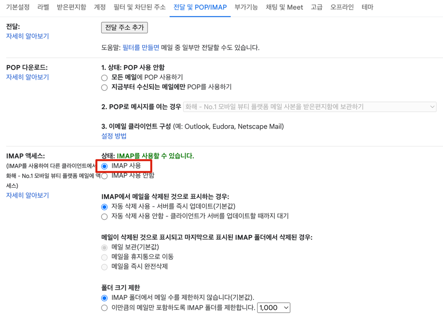

# What is autofortivpn
- **fortivpn** 연결 자동화를 위해서, **openfortivpn** 기반의 오픈소스인 **empatpuluh**에 기능을 추가한 자동화 툴
- 백그라운드 실행, 실행 상태 확인 등...

# How to setup
1. 2단계 인증 설정
   - https://myaccount.google.com/signinoptions/two-step-verification 에서 2단계 인증 설정 
   - https://myaccount.google.com/apppasswords 에서 앱 비밀번호 발급 
     - 앱 선택 : 메일
     - 기기 선택 : Mac

2. IMAP 설정
    - https://mail.google.com/mail/u/0/#settings/fwdandpop 접속 → IMAP 액세스 설정

3. `autofortivpn` 레포지토리를 클론받는다. 
4. 레포지토리 루트 경로에서 `sh setup` 커맨드를 실행한다.
5. **vpn username**, **vpn password**, **email account**, **2fa app password**를 차례로 입력한다.
    - vpn username, vpn password: 발급받은 vpn 아이디 및 비밀번호
    - email account: 본인 gmail 계정
    - 2fa app password: 1단계에서 발급받은 앱 비밀번호

* 마지막에 나오는 **Password** 입력은 본인 맥북 비밀번호 (`sudo` 커맨드로 인해 등장)

# How to use
- `runvpn` : vpn 실행
- `checkvpn` : vpn 실행 여부 확인
  - 실행중이면 `VPN ON`, 그렇지 않으면 `VPN OFF` 출력
- `killvpn` : vpn 종료